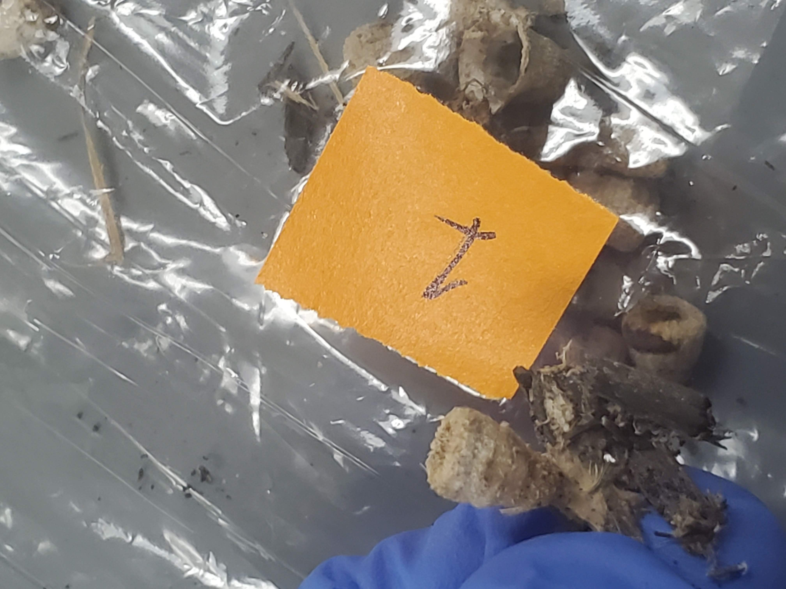

 [HOME](https://hgharmer.github.io/index.html) | [ABOUT ME](https://hgharmer.github.io/about-me/index.html) | [FINAL PROJECT](https://hgharmer.github.io/final_project/index.html) | [FUNGAL DATA](https://hgharmer.github.io/Fungal_proj/index.html)

<style>
div.gray { background-color:#008080; border-radius: 5px; padding: 20px;}
</style>
<div class = "gray">

```{r setup, include=FALSE}
knitr::opts_chunk$set(echo = TRUE)
library(sangerseqR)
library(downloadthis)
```

## Fungal Chromatograms

</div>


<style>
div.blue { background-color:#a89d82; border-radius: 5px; padding: 20px;}
</style>
<div class = "blue">


## Data download
 
[download .ab1 and .seq files](ab1andseq.zip)

## Sample 1


```{r echo=FALSE, message=FALSE, warning=FALSE}
seq1 <- sangerseq(read.abif('HaganSarahSeq/1_HHSB_A04.ab1'))


  chromatogram(seq1, width = 80, height = 3, trim5 = 0, 
             trim3 =600, showcalls = 'primary' )
```



## Sample 2

```{r echo=FALSE, message=FALSE, warning=FALSE}
#2##########################################################################
seq2 <- sangerseq(read.abif('HaganSarahSeq/2_HHSB_B04.ab1'))


chromatogram(seq2, width = 80, height = 3, trim5 = 0, 
             trim3 =400, showcalls = 'primary' )

```


## Sample 3

```{r echo=FALSE, message=FALSE, warning=FALSE}
#3#######################################################################
seq3 <- sangerseq(read.abif('HaganSarahSeq/3_HHSB_C04.ab1'))


chromatogram(seq3, width = 80, height = 3, trim5 = 0, 
             trim3 =700, showcalls = 'primary' )


```


## Sample 4

```{r echo=FALSE, message=FALSE, warning=FALSE}
#4######################################################################
seq4 <- sangerseq(read.abif('HaganSarahSeq/4_HHSB_D04.ab1'))


chromatogram(seq4, width = 80, height = 3, trim5 = 0, 
             trim3 =500, showcalls = 'both' )

```


## Sample 5

```{r echo=FALSE, message=FALSE, warning=FALSE}
#5######################################################################
seq5 <- sangerseq(read.abif('HaganSarahSeq/5_HHSB_E04.ab1'))


chromatogram(seq5, width = 80, height = 3, trim5 = 0, 
             trim3 =600, showcalls = 'primary' )

```


## Sample 7

```{r echo=FALSE, message=FALSE, warning=FALSE}
#7######################################################################
seq7 <- sangerseq(read.abif('HaganSarahSeq/7_HHSB_F04.ab1'))


chromatogram(seq7, width = 80, height = 3, trim5 = 0, 
             trim3 =550, showcalls = 'primary' )

```


## Sample 8

```{r echo=FALSE, message=FALSE, warning=FALSE}
#8######################################################################
seq8 <- sangerseq(read.abif('HaganSarahSeq/8_HHSB_G04.ab1'))


chromatogram(seq8, width = 80, height = 3, trim5 = 0, 
             trim3 =640, showcalls = 'primary' )


```


## Sample 9

```{r echo=FALSE, message=FALSE, warning=FALSE}
#9######################################################################
seq9 <- sangerseq(read.abif('HaganSarahSeq/9_HHSB_H04.ab1'))


chromatogram(seq9, width = 80, height = 3, trim5 = 0, 
             trim3 =600, showcalls = 'primary' )

```


## Sample 10

```{r echo=FALSE, message=FALSE, warning=FALSE}
#10######################################################################
seq10 <- sangerseq(read.abif('HaganSarahSeq/10_HHSB_A05.ab1'))


chromatogram(seq10, width = 80, height = 3, trim5 = 0, 
             trim3 =370, showcalls = 'primary' )

```


## Sample 12

```{r echo=FALSE, message=FALSE, warning=FALSE}
#12######################################################################
seq12 <- sangerseq(read.abif('HaganSarahSeq/12_HHSB_B05.ab1'))


chromatogram(seq12, width = 80, height = 3, trim5 = 0, 
             trim3 =370, showcalls = 'primary' )

```


## Sample 13

```{r echo=FALSE, message=FALSE, warning=FALSE}
#13######################################################################
seq13 <- sangerseq(read.abif('HaganSarahSeq/13_HHSB_C05.ab1'))


chromatogram(seq13, width = 80, height = 3, trim5 = 0, 
             trim3 =370, showcalls = 'primary' )


```


## Sample 14

```{r echo=FALSE, message=FALSE, warning=FALSE}
#14######################################################################
seq14 <- sangerseq(read.abif('HaganSarahSeq/14_HHSB_D05.ab1'))


chromatogram(seq14, width = 80, height = 3, trim5 = 0, 
             trim3 =370, showcalls = 'primary' )

```


## Sample 15

```{r echo=FALSE, message=FALSE, warning=FALSE}
#15######################################################################
seq15 <- sangerseq(read.abif('HaganSarahSeq/15_HHSB_E05.ab1'))


chromatogram(seq15, width = 80, height = 3, trim5 = 0, 
             trim3 =270, showcalls = 'primary' )

```


## Sample 16

```{r echo=FALSE, message=FALSE, warning=FALSE}
#16######################################################################
seq16 <- sangerseq(read.abif('HaganSarahSeq/16_HHSB_F05.ab1'))


chromatogram(seq16, width = 80, height = 3, trim5 = 0, 
             trim3 =910, showcalls = 'primary' )

```


## Sample 17

```{r echo=FALSE, message=FALSE, warning=FALSE}
#17######################################################################
seq17 <- sangerseq(read.abif('HaganSarahSeq/17_HHSB_G05.ab1'))


chromatogram(seq17, width = 80, height = 3, trim5 = 0, 
             trim3 =370, showcalls = 'primary' )


```


## Sample 19

```{r echo=FALSE, message=FALSE, warning=FALSE}
#19######################################################################
seq19 <- sangerseq(read.abif('HaganSarahSeq/19_HHSB_H05.ab1'))


chromatogram(seq19, width = 80, height = 3, trim5 = 0, 
             trim3 =370, showcalls = 'primary' )

```


## Sample 20

```{r echo=FALSE, message=FALSE, warning=FALSE}
#20######################################################################
seq20 <- sangerseq(read.abif('HaganSarahSeq/20_HHSB_A06.ab1'))


chromatogram(seq20, width = 80, height = 3, trim5 = 0, 
             trim3 =420, showcalls = 'primary' )

```


## Other Samples

These samples had little to no amplification during PCR.


</div>