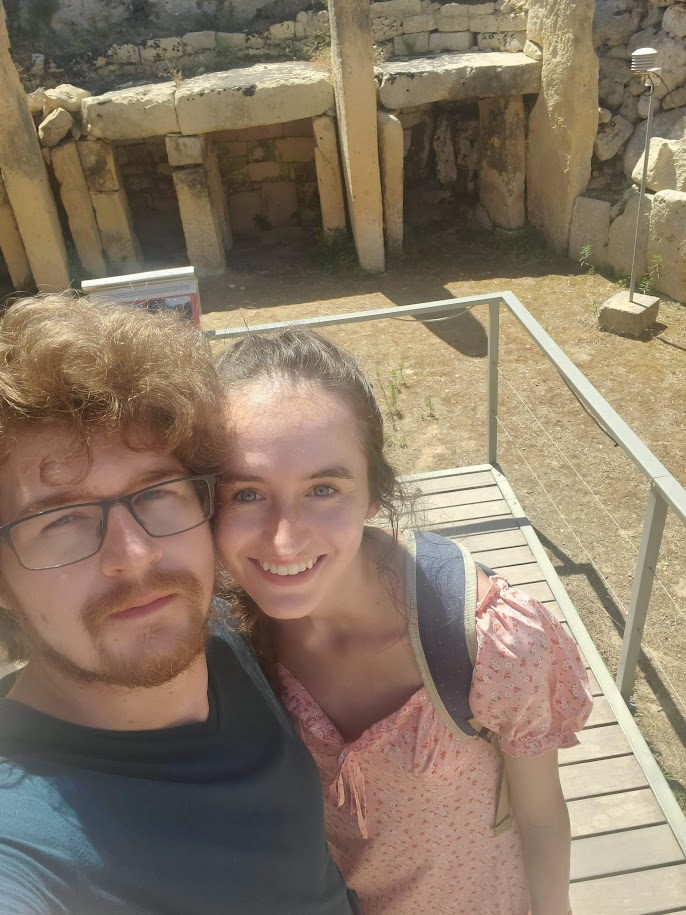

```{r setup, include=FALSE}
knitr::opts_chunk$set(echo = TRUE)
```
## [HOME](https://hgharmer.github.io/index.html) | [ABOUT ME](https://hgharmer.github.io/about-me/index.html) | [FINAL PROJECT](https://hgharmer.github.io/final_project/index.html) | [FUNGAL DATA](https://hgharmer.github.io/Fungal_proj/index.html)
___
<style>
div.gray { background-color:#008080; border-radius: 5px; padding: 20px;}
</style>
<div class = "gray">

# **About Me** 
___


<div style= "float:right;position: relative;top:10px">
```{r echo=FALSE}

```
</div>

### I am a biotech major at UVU. While I'm generally interested in studying all of the kingdoms of life, my current favorite is fungi.

### When I'm not studdying or doing school work I spend my free time trying out new recipes, hiking, and spending time with my wonderfull wife.

</div>
<style>
div.blue { background-color:#a89d82; border-radius: 5px; padding: 20px;}
</style>
<div class = "blue">


</div>

